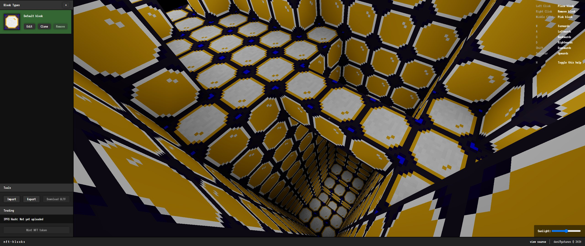

[nft-blocks](https://projects.gatunes.com/nft-blocks/)
==

[](https://projects.gatunes.com/nft-blocks/)

#### Local development

```bash
# clone this repo
git clone https://github.com/danielesteban/nft-blocks.git
cd nft-blocks
# install dependencies
npm install
# start local blockchain & IPFS node:
npm run services
# once started, copy & import a "private key" to your wallet

# from another terminal,
# deploy the contracts & start the dev environment:
npm run contracts:migrate
npm start
# open http://localhost:8080/ in your browser
```
